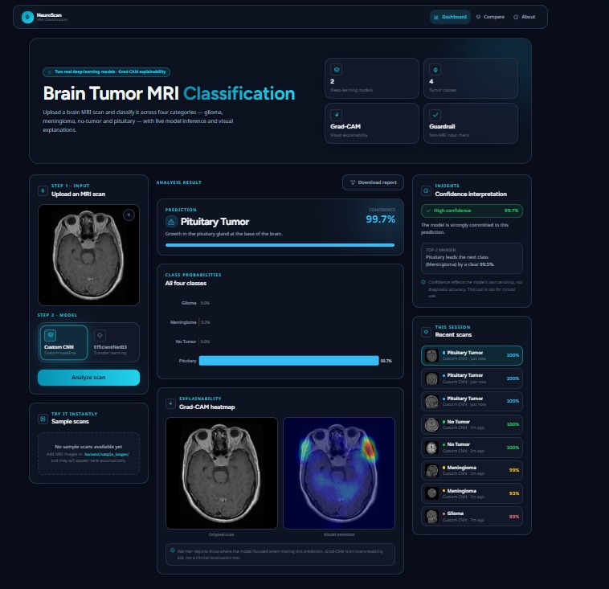

# NeuroScan MRI Classifier

A full-stack **educational** AI web application for brain MRI tumor classification
using a **Custom CNN** and an **EfficientNetB3** transfer-learning model — with
Grad-CAM explainability, side-by-side model comparison, and a non-MRI input
guardrail.

[](https://neuroscan-mri-classifier.vercel.app)
[](https://huggingface.co/spaces/ahmed-essam/brain-tumor-mri-backend)
[](https://ahmed-essam-brain-tumor-mri-backend.hf.space/health)

> ⚠️ **Educational / portfolio demonstration only.** This is **not** a medical
> device and must **never** be used for real medical diagnosis or treatment
> decisions. See the full [disclaimer](#-disclaimer) below.

## 🔗 Live demo

| Resource | URL |
| -------- | --- |
| **Live App** (frontend) | https://neuroscan-mri-classifier.vercel.app |
| **Backend API health** | https://ahmed-essam-brain-tumor-mri-backend.hf.space/health |
| **Hugging Face Space** (backend) | https://huggingface.co/spaces/ahmed-essam/brain-tumor-mri-backend |

## 📸 Screenshot



> _Try it live: **https://neuroscan-mri-classifier.vercel.app**_

## ✨ Key features

- **MRI image upload** with instant inference
- **Brain tumor classification** into four classes: `glioma`, `meningioma`, `pituitary`, `notumor`
- **Two models, side by side** — a Custom CNN and a fine-tuned EfficientNetB3 (Compare page)
- **Confidence interpretation** of each prediction
- **Grad-CAM visualization** showing where the model focused
- **Downloadable prediction report**
- **Session history** of recent predictions
- **Non-MRI image validation guardrail** — rejects obvious non-MRI inputs before inference
- **Educational-only medical disclaimer** shown persistently on every page
- **Public deployment** — Vercel (frontend) + Hugging Face Spaces Docker (backend)

## 🧰 Tech stack

- **Frontend:** Next.js (App Router), TypeScript, Tailwind CSS
- **Backend:** FastAPI, TensorFlow / Keras
- **Models:** Custom CNN, EfficientNetB3 (transfer learning)
- **Deployment:** Vercel, Hugging Face Spaces (Docker)
- **DevOps:** Docker / Docker Compose, Git LFS

## 🏗️ Architecture

```
Browser ──HTTPS──▶ Vercel (Next.js frontend)
                      │  NEXT_PUBLIC_API_URL (build-time)
                      └──HTTPS──▶ Hugging Face Space (FastAPI + TensorFlow, Docker)
                                  *.keras model weights via Git LFS
```

- **Vercel** hosts the Next.js frontend (root: `brain-tumor-mri-app/frontend`).
- **Hugging Face Spaces** hosts the FastAPI + TensorFlow backend as a Docker
  Space (`app_port: 8000`).
- **Git LFS** stores the `.keras` model weights so the repos stay lean and the
  real weights deploy correctly.
- **`NEXT_PUBLIC_API_URL`** connects the frontend to the backend; all client
  calls flow through `frontend/lib/api.ts` (no hardcoded URLs). CORS on the
  backend is controlled by `CORS_ORIGINS` (+ a `*.vercel.app` regex for
  preview deployments).

## 💻 Local setup (Docker Compose)

```bash
# Git LFS is required so the .keras weights are real files, not pointers
git lfs install
git clone https://github.com/ahmedessam792/neuroscan-mri-classifier.git
cd neuroscan-mri-classifier/brain-tumor-mri-app
docker compose up --build
```

- Frontend → http://localhost:3000
- Backend (Swagger docs) → http://localhost:8000/docs

**Environment variables**

| Service  | Variable              | Purpose |
| -------- | --------------------- | ------- |
| frontend | `NEXT_PUBLIC_API_URL` | Backend base URL (baked at build time). Defaults to `http://localhost:8000`. |
| backend  | `CORS_ORIGINS`        | Comma-separated allowed frontend origins. Defaults to localhost. |
| backend  | `CORS_ORIGIN_REGEX`   | Optional regex; defaults to allowing `https://*.vercel.app`. |

A local frontend `.env.local` is git-ignored — never commit real environment values.

## 🔌 API endpoints

| Method | Path        | Purpose |
| ------ | ----------- | ------- |
| GET    | `/health`   | Service + model readiness, TF/Keras versions |
| GET    | `/metrics`  | Parsed `model_comparison.csv` (or `available:false`) |
| GET    | `/samples`  | List bundled sample MRI images |
| POST   | `/predict`  | `image` + `model` → top class, 4 probabilities, Grad-CAM |
| POST   | `/compare`  | `image` → results from **both** models |

Interactive docs: `…/docs`.

## 📊 Model performance summary

Measured on a held-out test split (educational dataset). **Not** medical-grade
accuracy and **not** clinically validated.

| Model | Params | Test accuracy | Macro F1 | Notes |
| ----- | ------ | ------------- | -------- | ----- |
| Custom CNN (VGG-style) | ~1.24 M | 91.5% | 0.913 | Trained from scratch — lightweight and competitive |
| EfficientNetB3 (transfer learning) | ~10.99 M | 92.5% | 0.923 | ImageNet-pretrained + fine-tuned — slightly stronger test performance |

The **Custom CNN** is far smaller yet stays close to the larger model, while
**EfficientNetB3** achieves a small edge on test accuracy and F1. These numbers
reflect a finite public dataset and four fixed categories only.

## 📁 Repository structure

```
neuroscan-mri-classifier/
├── README.md                     # this file
├── .gitattributes                # Git LFS: *.keras
└── brain-tumor-mri-app/
    ├── README.md                 # detailed app documentation
    ├── docker-compose.yml
    ├── backend/                  # FastAPI + TensorFlow service
    │   ├── main.py               # API + endpoints
    │   ├── inference.py          # model loading, preprocessing, Grad-CAM
    │   ├── config.py             # class labels + model registry
    │   ├── validation.py         # non-MRI input guardrail
    │   ├── models/               # *.keras weights (Git LFS)
    │   ├── sample_images/        # bundled sample MRIs
    │   ├── requirements.txt
    │   └── Dockerfile
    └── frontend/                 # Next.js app
        ├── app/                  # routes (home, compare, about)
        ├── components/           # uploader, charts, Grad-CAM, gallery…
        ├── lib/api.ts            # single source for all backend calls
        ├── public/
        ├── Dockerfile
        └── next.config.ts
```

## 🚀 Future improvements

- Authenticated prediction history (per-user)
- Optional Supabase storage / database for saved results
- More robust out-of-distribution (OOD) detection beyond the current guardrail
- A larger, more diverse set of sample images
- Better monitoring / logging and request observability

## ⚠️ Disclaimer

This project is for **education and portfolio demonstration only**. The models
are **not** clinically validated, were trained on a finite public dataset, and
can only distinguish among four fixed categories (`glioma`, `meningioma`,
`notumor`, `pituitary`). It must **not** be used for real medical diagnosis,
screening, or treatment decisions. Always consult a qualified medical
professional.
